# 🍀 Smart Factory & Medical Waste Classification System

Sistem terintegrasi **IoT (Internet of Things)** dan **Artificial Intelligence (AI)** untuk manajemen pabrik pintar (*Smart Factory*) dan pemilahan otomatis limbah medis menggunakan **YOLOv8 Classification** dan **ESP32 DevKit C v4 + ESP32-CAM**.

Sistem ini memadukan sensor industri, aktuator mekanik, streaming video TCP *high-speed*, kontrol WebSockets real-time, pengenalan wajah (*facial recognition*), serta klasifikasi cerdas limbah medis ke dalam kategori B3, Infeksius, dan Non-Infeksius.

---

## 📌 Fitur Utama Sistem

*   **Real-time IoT Web Dashboard**: Dashboard premium berbasis HTML/CSS/JS yang di-host langsung di ESP32 menggunakan protokol WebSockets (port 81) untuk transmisi data sensor sensor tanpa delay.
*   **Medical Waste Classification (YOLOv8-cls)**: Menggunakan arsitektur Deep Learning YOLOv8-classification (`yolov8n-cls.pt`) untuk mengklasifikasikan limbah medis secara real-time dari kamera.
*   **Automatic Face Sorting / Gate Control**: Deteksi wajah menggunakan *Haar Cascade* OpenCV untuk mendeteksi operator di depan mesin. Pintu gerbang (Servo 1) terbuka otomatis saat wajah terdeteksi.
*   **Triple Servo & DC Motor Integration**: Kontrol motor DC L298N (Maju, Mundur, Stop dengan PWM Speed) serta 3 buah motor Servo secara bersamaan via Web IoT dan Python.
*   **Advanced Industrial Protection System**:
    *   **MQ-2 Gas/Asap**: Proteksi kebakaran dengan fitur warm-up sensor otomatis.
    *   **Water Level**: Monitoring kebocoran air dengan threshold level.
    *   **Flame Sensor**: Deteksi titik api (analog & digital).
    *   **RGB Status LED & Buzzer**: Alarm aktif berkedip secara dinamis sesuai kategori bahaya (Api, Gas, Air).

---

## 🏗️ Arsitektur Sistem

Berikut adalah alur interaksi data antara **ESP32-CAM**, **Python AI Engine (YOLOv8 & OpenCV)**, dan **ESP32 Main Controller**:

```mermaid
sequenceDiagram
    autonumber
    participant Cam as ESP32-CAM
    participant Py as Python AI Engine (YOLOv8)
    participant ESP as ESP32 Main Board
    participant Web as Web Dashboard (Browser)

    Note over Cam,ESP: Semua perangkat terhubung ke WiFi "Absolute Solver"
    
    Cam->>Py: Kirim video stream JPEG (TCP Port 80)
    Note over Py: 1. Jalankan Deteksi Wajah (OpenCV)<br/>2. Jalankan Klasifikasi Limbah (YOLOv8-cls)
    
    rect rgb(30, 40, 50)
        Note over Py,ESP: Jika wajah terdeteksi
        Py->>ESP: Kirim WebSocket: {"cmd": "machine", "on": true}
        Py->>ESP: Kirim WebSocket: {"cmd": "servo", "id": 1, "angle": 90}
        Note over ESP: Servo 1 berputar ke 90° (Gerbang Buka)
    end

    rect rgb(40, 30, 30)
        Note over Py,ESP: Hasil klasifikasi limbah medis
        Py->>Py: Overlay frame (Warna kategori & aksi kantong)
    end

    ESP->>Web: Broadcast status sensor (WebSockets Port 81)
    Web->>ESP: Kirim perintah manual Motor/Servo (WebSockets Port 81)
```



---

## 🔌 Pemetaan Pin Perangkat (Pinout Map)

### 1. ESP32 Main Board (ESP32 DevKit C v4)

Berikut adalah tabel koneksi pin hardware untuk modul kontrol utama:

| Nama Komponen | Pin ESP32 | Tipe Pin | Keterangan / Catatan |
| :--- | :---: | :---: | :--- |
| **LCD I2C SDA** | GPIO 21 | I2C | Koneksi data layar LCD |
| **LCD I2C SCL** | GPIO 22 | I2C | Koneksi clock layar LCD |
| **Buzzer** | GPIO 32 | Digital Out | Alarm aktif saat bahaya terdeteksi |
| **Push Button** | GPIO 5 | Digital In | `INPUT_PULLUP` (Toggle motor maju/stop) |
| **Servo 1** | GPIO 33 | PWM Out | Kontrol Gerbang Otomatis (Face Detection) |
| **Servo 2** | GPIO 19 | PWM Out | Dioperasikan manual via Web Dashboard |
| **Servo 3** | GPIO 18 | PWM Out | Dioperasikan manual via Web Dashboard |
| **MQ-2 Gas AOUT** | GPIO 26 | Analog In | Pembacaan kadar gas/asap (ADC 12-bit) |
| **MQ-2 Gas DOUT** | GPIO 27 | Digital In | Tidak digunakan di program utama |
| **Water Level AOUT** | GPIO 14 | Analog In | Sensor level air (ADC1_CH6) |
| **Flame Sensor AOUT** | GPIO 34 | Analog In | Deteksi intensitas radiasi api |
| **Flame Sensor DOUT** | GPIO 13 | Digital In | `INPUT_PULLDOWN` (Digital alarm api) |
| **RGB LED - Red** | GPIO 15 | PWM Out | Sinyal warna merah (Alarm Api) |
| **RGB LED - Green** | GPIO 2 | PWM Out | Sinyal warna hijau (Kondisi normal) |
| **RGB LED - Blue** | GPIO 23 | PWM Out | Sinyal warna biru (Alarm Air) |
| **L298N IN1** | GPIO 4 | Digital Out | Driver Motor DC (Arah Putaran) |
| **L298N IN2** | GPIO 17 | Digital Out | Driver Motor DC (Arah Putaran) |
| **L298N ENA** | GPIO 16 | PWM Out | Driver Motor DC (Kontrol Kecepatan) |

### 2. ESP32-CAM (AI-Thinker)

Kamera pengawas dipasang pada modul ESP32-CAM dengan pinout default AI-Thinker:

*   **Senter/Flash**: GPIO 4 (Dikunci otomatis dalam keadaan `HIGH` / Selalu Menyala untuk pencahayaan konstan saat klasifikasi gambar).
*   **Port TCP Streaming**: Port 80.
*   **Port WebSocket Control**: Port 81.

---

## 💻 Panduan Instalasi & Persiapan

### 1. Prasyarat Hardware & Firmware (Arduino IDE)

Sebelum melakukan upload sketch pada folder `Esp32/` dan `Esp32_CAM/`, pastikan Anda menginstal board **ESP32** di Arduino IDE dan mengunduh library berikut:

1.  **ESP32Servo** (Oleh Kevin Harrington) — Untuk kontrol motor servo yang halus pada chip ESP32.
2.  **WebSockets** (Oleh Markus Sattler) — Untuk koneksi komunikasi WebSockets server & client.
3.  **ArduinoJson** (Oleh Benoit Blanchon) — Untuk parse data JSON perintah aktuator.
4.  **LiquidCrystal_I2C** (Oleh Frank de Brabander) — Untuk menampilkan status pada layar LCD I2C.

> [!IMPORTANT]
> Pastikan kredensial WiFi pada program `SSID` dan `PASSWORD` sudah sesuai dengan jaringan lokal Anda:
> ```cpp
> #define WIFI_SSID   "Absolute Solver"
> #define WIFI_PASS   "CynIsMyRobo18z"
> ```

### 2. Prasyarat Software & AI Engine (Python)

Buka terminal atau command prompt pada komputer Anda, masuk ke direktori `Python/`, lalu jalankan instalasi dependency Python berikut:

```bash
pip install ultralytics opencv-python numpy pillow websocket-client
```

---

## 🎯 Panduan Training YOLOv8-cls (Klasifikasi Limbah Medis)

Sistem menggunakan model klasifikasi YOLOv8 (`yolov8n-cls`). Ikuti langkah-langkah berikut untuk melatih model kustom menggunakan dataset Anda sendiri:

### 1. Struktur Folder Datasheet
Letakkan foto/gambar sampel limbah medis Anda ke dalam folder `Python/Datasheet/` dengan struktur wajib 2 tingkat seperti di bawah ini:

```text
Python/
└── Datasheet/
    ├── Limbah B3/
    │   ├── Obat 1/        <-- Tiap subfolder terdalam menjadi 1 kelas klasifikasi
    │   └── Obat 2/
    ├── Limbah Infeksius/
    │   └── Plester/
    └── Limbah Non-Infeksius/
        ├── Kain kasa/
        └── Tisu Antiseptik/
```

### 2. Memulai Proses Training
Jalankan file `train_yolo.py` untuk membagi dataset secara otomatis (80% Training, 20% Validasi) dan memulai training YOLOv8:

```bash
python Python/train_yolo.py
```

*   **Epochs default**: 50 Epochs.
*   **Ukuran gambar**: 320x320 px (dioptimalkan untuk kecepatan inferensi real-time di ESP32-CAM).
*   **Output Model**: Hasil bobot model terbaik akan otomatis disimpan di folder `Python/waste_model/weights/best.pt`.

---

## 🚀 Cara Menjalankan Sistem

Setelah semua firmware berhasil di-upload dan model YOLOv8 telah dilatih:

### Langkah 1: Nyalakan ESP32 Utama
1. Hubungkan ESP32 Utama ke komputer atau adaptor daya.
2. Buka **Serial Monitor** pada Arduino IDE (Baudrate: `115200`).
3. Catat alamat IP yang didapatkan (Contoh: `192.168.8.199`).
4. Alamat IP tersebut juga akan muncul pada layar fisik **LCD I2C**.

### Langkah 2: Akses Web Dashboard IoT
1. Buka browser pada komputer atau smartphone yang berada dalam satu jaringan WiFi.
2. Masukkan alamat IP ESP32 ke address bar browser (contoh: `http://192.168.8.199`).
3. Dashboard premium bernuansa futuristik gelap akan terbuka, menyajikan pembacaan sensor gas, air, api, tombol, kontrol sudut 3 Servo, dan arah serta kecepatan Motor DC secara real-time.

### Langkah 3: Nyalakan ESP32-CAM
1. Hubungkan ESP32-CAM ke sumber daya.
2. Catat alamat IP kamera yang terdeteksi di Serial Monitor (Contoh: `192.168.8.136`).

### Langkah 4: Hubungkan AI Engine Python
1. Buka file `Python/main_yolo.py`.
2. Sesuaikan konfigurasi IP di baris 27-32 dengan alamat IP riil yang Anda dapatkan pada Langkah 1 & 3:
   ```python
   CAM_IP        = "192.168.8.136"  # Alamat IP ESP32-CAM
   SMART_IP      = "192.168.8.199"  # Alamat IP ESP32 Utama
   ```
3. Jalankan skrip AI utama:
   ```bash
   python Python/main_yolo.py
   ```

---

## 🎮 Navigasi & Operasi Python Window

Ketika jendela OpenCV video stream menyala di komputer, Anda dapat menggunakan tombol keyboard berikut untuk berinteraksi:

*   **Tombol `S`**: Mengambil screenshot gambar mentah (*raw frame*) secara manual dan menyimpannya ke folder `Python/training_data/manual/`. Sangat berguna untuk menambah dataset.
*   **Tombol `A`**: Mengaktifkan/menonaktifkan mode **Auto-Capture**. Sistem akan mengambil screenshot otomatis secara berkala untuk setiap kelas limbah medis yang sedang terdeteksi di depan kamera ke folder `Python/training_data/<nama_kelas>/`.
*   **Tombol `Q`**: Menutup aplikasi Python secara aman dan mematikan seluruh soket komunikasi dengan ESP32.

---

## 🚨 Logika Sistem Alarm & Keamanan

Modul ESP32 secara otonom memantau kondisi kritis di pabrik tanpa bergantung pada koneksi internet atau Python:

*   **Bahaya Api (Flame Sensor)**:
    *   Jika api terdeteksi (digital/analog), Buzzer berbunyi nyaring.
    *   Layar LCD menampilkan teks peringatan kebakaran.
    *   Lampu LED RGB berkedip cepat warna **Merah & Jingga** (`COL_FLAME_A` & `COL_FLAME_B`).
*   **Bahaya Gas/Asap (MQ-2 Sensor)**:
    *   Jika kadar gas/asap melebihi batas toleransi baseline, Buzzer berbunyi putus-putus.
    *   Layar LCD memunculkan alarm gas.
    *   Lampu LED RGB berkedip warna **Ungu & Merah Muda** (`COL_GAS_A` & `COL_GAS_B`).
*   **Bahaya Kebocoran Air (Water Level)**:
    *   Jika air melebihi ambang batas (`WATER_THRESHOLD_ON` = 800), sistem memberikan peringatan air berlebih.
    *   Lampu LED RGB berkedip warna **Biru & Putih** (`COL_WATER_A` & `COL_WATER_B`).

---

### 👑 Dikembangkan Oleh:
*   **Author**: Mc.Zminecrafter18
*   **Workspace**: PTN / HIMTIKA / Lomba CNC Project
