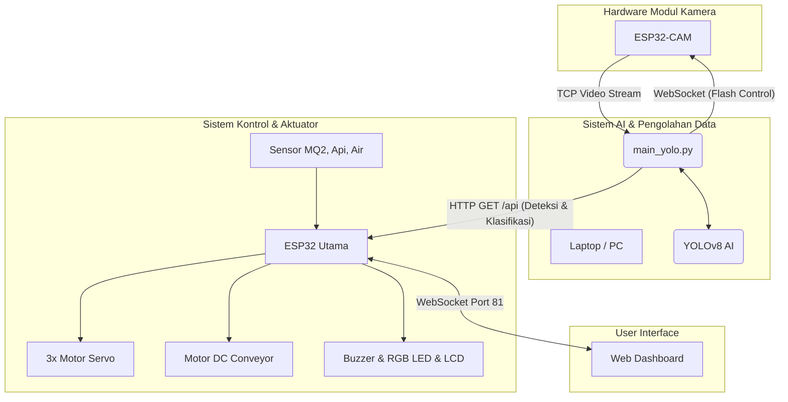

<div align="center">

# 🏥 AIoT Medical Waste Sorting Systems

**Sistem Deteksi & Pemilah Limbah Medis Cerdas Berbasis AI Computer Vision & IoT**

[](https://www.espressif.com/)
[](https://ultralytics.com/)
[](https://opencv.org/)
[](https://www.python.org/)
[](https://www.arduino.cc/)

</div>

---

## 📖 Daftar Isi
- [Deskripsi Proyek](#-deskripsi-proyek)
- [Fitur Utama](#-fitur-utama)
- [Peta Pin ESP32](#-peta-pin-esp32)
- [Struktur Proyek](#-struktur-proyek)
- [Dependensi & Library](#-dependensi--library)
- [Panduan Penggunaan](#-panduan-penggunaan)
- [Cara Melatih Model AI](#-cara-melatih-model-ai-sendiri)
- [Arsitektur Sistem](#-arsitektur-sistem)

---

## 📌 Deskripsi Proyek

Proyek ini adalah purwarupa (prototipe) **Sistem Pemilah Limbah Medis Otomatis** yang mengintegrasikan *Computer Vision* berbasis AI dengan mikrokontroler ESP32. Sistem dirancang untuk mendeteksi berbagai jenis limbah medis secara *real-time* menggunakan kamera dan model YOLOv8, lalu secara otomatis memisahkannya ke dalam kategori yang tepat:

| Kategori | Tempat | Warna Kantong |
|:---:|:---:|:---:|
| 🟡 **Limbah Infeksius** | Gerbang Servo 1 | Kantong **KUNING** |
| ⚫ **Limbah Non-Infeksius** | Gerbang Servo 2 | Kantong **HITAM** |
| 🔴 **Limbah B3 (Berbahaya)** | Gerbang Servo 3 | Kantong **MERAH** |

Sistem juga dilengkapi dengan serangkaian sensor keselamatan dan peringatan dini untuk mencegah risiko bahaya di area pembuangan limbah, menjadikannya sistem yang **responsif**, **cerdas**, dan **aman**.

---

## ✨ Fitur Utama

### 🤖 AI Computer Vision
- **YOLOv8**: Deteksi dan klasifikasi limbah medis secara *real-time*.
- **Kinerja Optimal**: Dilengkapi fitur *throttling* inferensi dan thread asinkron untuk menjaga performa kamera tetap mulus tanpa *lag*.
- **Fleksibel**: Mendukung penggunaan model **Object Detection** maupun **Classification**.
- **Face Detection (Haarcascade)**: *Conveyor* menyala otomatis saat operator terdeteksi dan berhenti saat operator pergi.

### ⚙️ Sistem Pemilahan Otomatis
- **Motor DC + L298N Driver**: Penggerak utama sabuk *conveyor*.
- **3x Motor Servo**: Membuka gerbang pemilah ke jalur penampungan yang sesuai dengan kategori limbah.
- **Logika *Hold-and-Release***: Servo akan terbuka dengan jeda waktu yang telah disesuaikan (berdasarkan jarak titik jatuh), kemudian tertutup otomatis.
- **Kendali Motor**: Mendukung pengaturan kecepatan PWM (0–255) langsung dari Web Dashboard.

### 🚨 Sensor Keselamatan & Peringatan Dini
| Sensor | Pin ESP32 | Fungsi |
|---|---|---|
| **MQ-2** | `GPIO 26` (Analog) | Deteksi kebocoran gas beracun atau asap |
| **Flame Sensor** | `GPIO 34` (Analog), `GPIO 13` (Digital) | Deteksi titik api |
| **Water Level** | `GPIO 14` (Analog) | Deteksi luapan cairan atau banjir |

**Sistem *Fail-Safe*:**
- Motor *conveyor* **berhenti seketika** saat terdeteksi bahaya.
- **Passive Buzzer** berbunyi nyaring (frekuensi 2kHz) sebagai alarm.
- **RGB LED** berkedip memberikan indikator visual bahaya (warna disesuaikan dengan jenis peringatan).
- Layar **LCD I2C 16x2** menampilkan teks notifikasi secara *real-time*.

### 🌐 Web Dashboard Control Panel
Antarmuka web yang modern, responsif, dan kaya fitur. Dapat diakses langsung via browser tanpa perlu instalasi aplikasi tambahan.

- **Mode Pengguna (Guest)**: Tampilan *Live View* untuk memonitor status sistem dan sensor.
- **Mode Admin (`Admin` / `Admin123`)**:
  - Kontrol manual Motor DC (Maju, Mundur, Stop, Slider Kecepatan).
  - Kontrol manual tiap Servo (0°–180°).
  - Monitoring metrik ADC dari tiap sensor secara presisi.
  - **Hardware Diagnostics (Test Mode)**: Memungkinkan pengujian setiap komponen *hardware* langsung melalui antarmuka web.

---

## 🗺️ Peta Pin ESP32

| Komponen | Pin ESP32 | Keterangan Tambahan |
|---|:---:|---|
| **LCD I2C SDA** | `21` | Komunikasi I2C |
| **LCD I2C SCL** | `22` | Komunikasi I2C |
| **Passive Buzzer** | `32` | `tone()` / `noTone()` |
| **Push Button** | `5` | `INPUT_PULLUP` |
| **Servo 1 (Infeksius)** | `33` | 50Hz PWM |
| **Servo 2 (Non-Inf.)** | `19` | 50Hz PWM |
| **Servo 3 (B3)** | `18` | 50Hz PWM |
| **MQ-2 (Gas) AOUT** | `26` | Analog |
| **Water Level AOUT** | `14` | Analog (ADC1_CH6) |
| **Flame AOUT** | `34` | Analog |
| **Flame DOUT** | `13` | Digital |
| **RGB LED - Red** | `15` | PWM (`ledcAttach`) |
| **RGB LED - Green** | `2` | PWM (`ledcAttach`) |
| **RGB LED - Blue** | `23` | PWM (`ledcAttach`) |
| **L298N IN1** | `4` | Arah motor |
| **L298N IN2** | `17` | Arah motor |
| **L298N ENA** | `16` | PWM kecepatan |

---

## 💻 Struktur Proyek

```text
📦 Code and all/
 ┣ 📂 Python/
 ┃ ┣ 📜 main_yolo.py         ← Script utama (Streaming kamera, Inferensi AI, Komunikasi ESP32)
 ┃ ┣ 📜 train_yolo.py        ← Script untuk melatih model YOLOv8 kustom
 ┃ ┣ 📜 label_manual.py      ← Tool untuk labeling data manual
 ┃ ┗ 📂 waste_model/
 ┃    ┗ 📂 weights/
 ┃       ┗ 📜 best.pt        ← Bobot AI hasil training (ignore-git)
 ┣ 📂 Esp32/
 ┃ ┗ 📜 Esp32.ino            ← Firmware utama ESP32 (Web Server, WebSockets, Sensor, Hardware)
 ┣ 📂 Esp32_CAM/
 ┃ ┗ 📂 Esp32_CAM/
 ┃    ┗ 📜 Esp32_CAM.ino     ← Firmware modul ESP32-CAM (TCP streaming video & kontrol Flash)
 ┣ 📂 Esp32_Hotspot/
 ┃ ┗ 📜 Esp32_Hotspot.ino    ← Firmware ESP32 sebagai dedicated Access Point (Router Lokal)
 ┣ 📂 Backup/
 ┃ ┣ 📜 Esp32_BACKUP.ino     ← Firmware cadangan ESP32 Utama
 ┃ ┗ 📜 Esp32CAM_BACKUP.ino  ← Firmware cadangan ESP32-CAM
 ┗ 📜 README.md              ← Dokumentasi Repositori
```

---

## ⚙️ Dependensi & Library

### 🔧 Arduino / ESP32 (Arduino IDE)
Pastikan menggunakan board manager **esp32 by Espressif Systems** (direkomendasikan v3.x).

| Library | Kegunaan |
|---|---|
| `ESP32Servo` | Mengontrol sinyal PWM untuk servo |
| `WebSocketsServer` | *(by Markus Sattler)* Menjalankan server WebSocket *real-time* |
| `ArduinoJson` | Parsing dan penyusunan struktur data JSON |
| `LiquidCrystal_I2C` | Pengendali layar LCD 16x2 berbasis I2C |
| `WiFi`, `WebServer` | Library bawaan untuk konektivitas jaringan & web server |

### 🐍 Python
Install dependensi Python melalui terminal:
```bash
pip install ultralytics opencv-python websocket-client numpy
```

---

## 🚀 Panduan Penggunaan

### Langkah 1: Persiapan ESP32 & ESP32-CAM
1. Tambahkan konfigurasi board ESP32 di **Arduino IDE** (`https://raw.githubusercontent.com/espressif/arduino-esp32/gh-pages/package_esp32_index.json`).
2. Install daftar library yang telah disebutkan di atas via **Library Manager**.
3. Buka `Esp32/Esp32.ino` dan atur SSID serta kata sandi WiFi Anda:
   ```cpp
   #define WIFI_SSID   "NamaWiFiAnda"
   #define WIFI_PASS   "PasswordWiFiAnda"
   ```
4. *Upload* program ke ESP32. Buka Serial Monitor (baud rate 115200) dan catat **IP Address** yang didapatkan.
5. Lakukan hal yang sama untuk mem-flash `Esp32CAM_BACKUP.ino` ke module ESP32-CAM Anda.

### Langkah 2: Sesuaikan IP pada Script Python
Buka file `Python/main_yolo.py` menggunakan teks editor pilihan Anda (mis. VS Code), lalu ubah variabel IP agar sesuai dengan IP Address yang didapatkan sebelumnya:
```python
CAM_IP       = "192.168.x.x"   # IP Address modul ESP32-CAM
SMART_IP     = "192.168.x.x"   # IP Address modul ESP32 Utama
```

### Langkah 3: Menjalankan Sistem Utama
Jalankan script Python melalui terminal:
```bash
cd "Python"
python main_yolo.py
```

**Daftar Kontrol Keyboard (Saat Window Kamera Aktif):**
| Tombol | Fungsi |
|:---:|---|
| `S` | Menyimpan *screenshot* manual frame saat ini |
| `A` | Menyalakan/mematikan (*toggle*) fitur Auto-Capture (berguna untuk panen dataset) |
| `F` | Menyalakan/mematikan lampu Flash (senter) pada modul ESP32-CAM |
| `Q` | Menghentikan program dengan aman (*Quit*) |

### Langkah 4: Mengakses Web Dashboard
Buka browser (disarankan Chrome atau Firefox) dan masuk ke: **`http://<IP-ESP32>/`**

- **Guest Login**: Klik opsi "Masuk sebagai Pengguna" (Tidak butuh password).
- **Admin Login**: Masuk ke Tab Admin, lalu ketikkan kredensial di bawah ini:
  - **Username:** `Admin`
  - **Password:** `Admin123`

---

## 🎓 Cara Melatih Model AI Sendiri

Ingin menambahkan jenis sampah medis baru atau memperbaiki akurasi deteksi? Anda dapat melatih model YOLO Anda sendiri:

1. Kumpulkan sampel gambar menggunakan mode **Auto-Capture** (tekan tombol `A`) yang sudah tersedia pada `main_yolo.py`.
2. Label dataset gambar yang sudah terkumpul menggunakan script bawaan `label_manual.py` atau gunakan platform seperti [Roboflow](https://roboflow.com/).
3. Lakukan proses pelatihan (training) menggunakan script berikut:
   ```bash
   python train_yolo.py
   ```
4. Setelah selesai, model terbaik secara otomatis akan tersimpan di dalam direktori `waste_model/weights/best.pt` dan siap digunakan.

---

## 📡 Arsitektur Sistem

Berikut adalah alur data dan interaksi antar perangkat dalam keseluruhan sistem:



---

## 🤝 Kontribusi

Proyek ini dikembangkan khusus untuk kebutuhan inovasi lomba dan kompetisi teknologi **CNC HIMTIKA**. Kami mengundang siapa pun untuk melakukan *fork* pada repositori ini dan menambahkan inovasinya sendiri. Jangan ragu untuk membuat *Pull Request* atau membuka *Issue* jika Anda menemukan *bug*!

---

> *"Proyek ini dibangun sebagai dedikasi untuk memecahkan permasalahan risiko penyortiran limbah medis manual yang berbahaya bagi para petugas medis dan petugas kebersihan, dengan merancang sistem cerdas nirsentuh yang andal, responsif, dan aman."*
