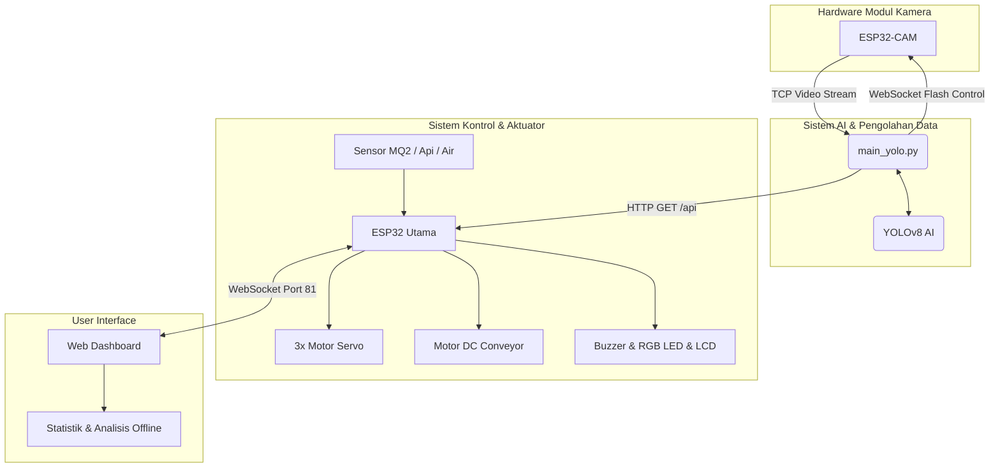

<div align="center">

# 🏥 AIoT Medical Waste Sorting Systems

**Sistem Deteksi & Pemilah Limbah Medis Cerdas Berbasis AI Computer Vision & IoT**

[](https://www.espressif.com/)
[](https://ultralytics.com/)
[](https://opencv.org/)
[](https://www.python.org/)
[](https://www.arduino.cc/)

</div>

---

## 📖 Daftar Isi
- [Deskripsi Proyek](#-deskripsi-proyek)
- [Fitur Utama](#-fitur-utama)
- [Peta Pin ESP32](#-peta-pin-esp32)
- [Struktur Proyek](#-struktur-proyek)
- [Dependensi & Library](#-dependensi--library)
- [Panduan Penggunaan](#-panduan-penggunaan)
- [Cara Melatih Model AI](#-cara-melatih-model-ai-sendiri)
- [Arsitektur Sistem](#-arsitektur-sistem)

---

## 📌 Deskripsi Proyek

Proyek ini adalah purwarupa (prototipe) **Sistem Pemilah Limbah Medis Otomatis** yang mengintegrasikan *Computer Vision* berbasis AI dengan mikrokontroler ESP32. Sistem dirancang untuk mendeteksi berbagai jenis limbah medis secara *real-time* menggunakan kamera dan model YOLOv8, lalu secara otomatis memisahkannya ke dalam kategori yang tepat:

| Kategori | Tempat | Warna Kantong |
|:---:|:---:|:---:|
| 🟡 **Limbah Infeksius** | Gerbang Servo 1 | Kantong **KUNING** |
| ⚫ **Limbah Non-Infeksius** | Gerbang Servo 2 | Kantong **HITAM** |
| 🔴 **Limbah B3 (Berbahaya)** | Gerbang Servo 3 | Kantong **MERAH** |

Sistem juga dilengkapi dengan serangkaian sensor keselamatan dan peringatan dini untuk mencegah risiko bahaya di area pembuangan limbah, menjadikannya sistem yang **responsif**, **cerdas**, dan **aman**.

---

## ✨ Fitur Utama

### 🤖 AI Computer Vision
- **YOLOv8**: Deteksi dan klasifikasi limbah medis secara *real-time*.
- **Kinerja Optimal**: Dilengkapi fitur *throttling* inferensi dan thread asinkron untuk menjaga performa kamera tetap mulus tanpa *lag*.
- **Fleksibel**: Mendukung penggunaan model **Object Detection** maupun **Classification**.
- **Face Detection (Haarcascade)**: *Conveyor* menyala otomatis saat operator terdeteksi dan berhenti saat operator pergi.

### ⚙️ Sistem Pemilahan Otomatis
- **Motor DC + L298N Driver**: Penggerak utama sabuk *conveyor*.
- **3x Motor Servo**: Membuka gerbang pemilah ke jalur penampungan yang sesuai dengan kategori limbah.
- **Logika *Hold-and-Release***: Servo akan terbuka dengan jeda waktu yang telah disesuaikan (berdasarkan jarak titik jatuh), kemudian tertutup otomatis.
- **Safety Lock Servo**: Servo sepenuhnya diblokir bergerak saat *Safety Lockout* aktif — tidak ada pembuangan limbah selama kondisi bahaya terdeteksi.
- **Kendali Motor**: Mendukung pengaturan kecepatan PWM (0–255) langsung dari Web Dashboard.

### 🚨 Sensor Keselamatan & Peringatan Dini
| Sensor | Pin ESP32 | Fungsi |
|---|---|---|
| **MQ-2** | `GPIO 35` (ADC1) | Deteksi kebocoran gas beracun atau asap |
| **Flame Sensor** | `GPIO 34` (Analog), `GPIO 13` (Digital) | Deteksi titik api |
| **Water Level** | `GPIO 36` (ADC1) | Deteksi luapan cairan atau banjir |

**Sistem *Fail-Safe*:**
- Motor *conveyor* **berhenti seketika** saat terdeteksi bahaya.
- **Passive Buzzer** berbunyi nyaring (frekuensi 2kHz) sebagai alarm.
- **RGB LED** berkedip memberikan indikator visual bahaya (warna disesuaikan dengan jenis peringatan).
- Layar **LCD I2C 16x2** menampilkan teks notifikasi secara *real-time*.

### 🌐 Web Dashboard Control Panel
Antarmuka web yang modern, responsif, dan kaya fitur. Dapat diakses langsung via browser **tanpa perlu instalasi** aplikasi tambahan dan berjalan **100% offline** (tidak butuh koneksi internet).

- **Mode Pengguna (Guest)**: Tampilan *Live View* untuk memonitor status sistem dan sensor.
- **Mode Admin (`Admin` / `Admin123`)**:
  - Kontrol manual Motor DC (Maju, Mundur, Stop, Slider Kecepatan).
  - Kontrol manual tiap Servo (0°–180°).
  - Monitoring metrik ADC dari tiap sensor secara presisi.
  - **Hardware Diagnostics (Test Mode)**: Memungkinkan pengujian setiap komponen *hardware* langsung melalui antarmuka web.

### 📊 Statistik & Analisis (Baru!)
Sistem kini dilengkapi panel analitik lengkap yang dapat diakses melalui tombol **☰** di pojok kanan atas dashboard:

- **Popup Notifikasi Sortir**: Setiap kali limbah berhasil disortir, notifikasi hijau muncul otomatis dari bagian atas layar.
- **Grafik Pie Limbah (SVG Offline)**: Proporsi tiap kategori limbah yang telah tersortir, 100% berjalan tanpa internet.
- **Daftar Limbah per Kategori**: Rincian jumlah tiap jenis limbah dikelompokkan (Infeksius / Non-Infeksius / B3) dengan total per kategori.
- **Grafik Garis Sensor (SVG Offline)**: Frekuensi kejadian alarm dari tiap sensor (Gas, Air, Api).
- **Penyimpanan Persisten**: Semua data tersimpan di `localStorage` browser — tidak hilang walaupun halaman di-*refresh*.
- **Cooldown 5 Detik**: Setiap kejadian bahaya hanya dihitung satu kali, mencegah *double-count* akibat jitter WebSocket.
- **Tombol Reset Terpisah**: Reset data limbah dan data sensor secara independen.
- **Sinkronisasi Penuh**: Data yang sama juga tersedia di `Web/admin_dashboard.html` (versi standalone untuk PC).

---

## 🗺️ Peta Pin ESP32

| Komponen | Pin ESP32 | Keterangan Tambahan |
|---|:---:|---|
| **LCD I2C SDA** | `21` | Komunikasi I2C |
| **LCD I2C SCL** | `22` | Komunikasi I2C |
| **Passive Buzzer** | `32` | PWM Channel 8 (2kHz) |
| **Push Button** | `5` | `INPUT_PULLUP` |
| **Servo 1 (Infeksius)** | `33` | 50Hz PWM |
| **Servo 2 (Non-Inf.)** | `19` | 50Hz PWM |
| **Servo 3 (B3)** | `18` | 50Hz PWM |
| **MQ-2 (Gas) AOUT** | `35` | ADC1 — aman saat WiFi aktif |
| **Water Level AOUT** | `36` | ADC1 — aman saat WiFi aktif |
| **Flame AOUT** | `34` | Analog |
| **Flame DOUT** | `13` | Digital |
| **RGB LED - Red** | `15` | PWM Channel 5 |
| **RGB LED - Green** | `2` | PWM Channel 6 |
| **RGB LED - Blue** | `23` | PWM Channel 7 |
| **L298N IN1** | `4` | Arah motor |
| **L298N IN2** | `17` | Arah motor |
| **L298N ENA** | `16` | PWM Channel 4 (100Hz) |

> ⚠️ **Catatan:** Pin ADC2 (GPIO 0, 2, 4, 12–15, 25–27) **tidak dapat digunakan** untuk pembacaan analog saat WiFi aktif pada ESP32. Seluruh sensor analog telah dipindahkan ke **ADC1**.

---

## 💻 Struktur Proyek

```text
📦 Code and all/
 ┣ 📂 Python/
 ┃ ┣ 📜 main_yolo.py         ← Script utama (Streaming kamera, Inferensi AI, Komunikasi ESP32)
 ┃ ┣ 📜 train_yolo.py        ← Script untuk melatih model YOLOv8 kustom
 ┃ ┣ 📜 label_manual.py      ← Tool untuk labeling data manual
 ┃ ┗ 📂 waste_model/
 ┃    ┗ 📂 weights/
 ┃       ┗ 📜 best.pt        ← Bobot AI hasil training (ignore-git)
 ┣ 📂 Esp32/
 ┃ ┗ 📜 Esp32.ino            ← Firmware utama ESP32 (Web Server, WebSockets, Sensor, Hardware)
 ┣ 📂 Esp32_CAM/
 ┃ ┗ 📂 Esp32_CAM/
 ┃    ┗ 📜 Esp32_CAM.ino     ← Firmware modul ESP32-CAM (TCP streaming video & kontrol Flash)
 ┣ 📂 Esp32_Hotspot/
 ┃ ┗ 📜 Esp32_Hotspot.ino    ← Firmware ESP32 sebagai dedicated Access Point (Router Lokal)
 ┣ 📂 Web/
 ┃ ┗ 📜 admin_dashboard.html ← Versi standalone dashboard (bisa dibuka langsung via browser PC)
 ┣ 📂 Backup/
 ┃ ┣ 📜 Esp32_BACKUP.ino     ← Firmware cadangan ESP32 Utama
 ┃ ┗ 📜 Esp32CAM_BACKUP.ino  ← Firmware cadangan ESP32-CAM
 ┗ 📜 README.md              ← Dokumentasi Repositori
```

---

## ⚙️ Dependensi & Library

### 🔧 Arduino / ESP32 (Arduino IDE)
Pastikan menggunakan board manager **esp32 by Espressif Systems** (direkomendasikan v3.x).

| Library | Kegunaan |
|---|---|
| `ESP32Servo` | Mengontrol sinyal PWM untuk servo |
| `WebSocketsServer` | *(by Markus Sattler)* Menjalankan server WebSocket *real-time* |
| `ArduinoJson` | Parsing dan penyusunan struktur data JSON |
| `LiquidCrystal_I2C` | Pengendali layar LCD 16x2 berbasis I2C |
| `WiFi`, `WebServer` | Library bawaan untuk konektivitas jaringan & web server |

### 🐍 Python
Install dependensi Python melalui terminal:
```bash
pip install ultralytics opencv-python websocket-client numpy
```

---

## 🚀 Panduan Penggunaan

### Langkah 1: Persiapan ESP32 & ESP32-CAM
1. Tambahkan konfigurasi board ESP32 di **Arduino IDE** (`https://raw.githubusercontent.com/espressif/arduino-esp32/gh-pages/package_esp32_index.json`).
2. Install daftar library yang telah disebutkan di atas via **Library Manager**.
3. Buka `Esp32/Esp32.ino` dan atur SSID serta kata sandi WiFi:
   ```cpp
   #define WIFI_SSID   "NamaWiFiAnda"
   #define WIFI_PASS   "PasswordWiFiAnda"
   ```
4. *Upload* program ke ESP32. Buka Serial Monitor (baud rate 115200) dan catat **IP Address** yang didapatkan.
5. Lakukan hal yang sama untuk mem-flash `Esp32_CAM.ino` ke modul ESP32-CAM.

### Langkah 2: Sesuaikan IP pada Script Python
Buka `Python/main_yolo.py`, lalu ubah variabel IP sesuai dengan IP yang didapatkan:
```python
CAM_IP       = "192.168.x.x"   # IP Address modul ESP32-CAM
SMART_IP     = "192.168.x.x"   # IP Address modul ESP32 Utama
```

### Langkah 3: Menjalankan Sistem Utama
```bash
cd "Python"
python main_yolo.py
```

**Daftar Kontrol Keyboard (Saat Window Kamera Aktif):**
| Tombol | Fungsi |
|:---:|---|
| `S` | Menyimpan *screenshot* manual frame saat ini |
| `A` | Toggle fitur Auto-Capture (untuk panen dataset) |
| `F` | Toggle lampu Flash pada modul ESP32-CAM |
| `Q` | Menghentikan program dengan aman (*Quit*) |

### Langkah 4: Mengakses Web Dashboard
Buka browser dan masuk ke: **`http://<IP-ESP32>/`**

- **Guest Login**: Klik "Masuk sebagai Pengguna" (tidak butuh password).
- **Admin Login**: Username `Admin`, Password `Admin123`.

### Langkah 5: Panel Statistik & Analisis
1. Pastikan sistem sudah **di-START** dari dashboard.
2. Klik tombol **`☰`** di pojok **kanan atas** header.
3. Panel sidebar akan terbuka dan menampilkan:
   - **Grafik Pie** proporsi limbah per kategori.
   - **Daftar Limbah** dikelompokkan per kategori dengan total.
   - **Grafik Garis Sensor** frekuensi kejadian bahaya.
   - **Daftar Sensor** Gas / Air / Api beserta jumlah kejadiannya.
4. Gunakan **"Reset Data Limbah"** atau **"Reset"** untuk menghapus riwayat.

---

## 🎓 Cara Melatih Model AI Sendiri

1. Kumpulkan gambar menggunakan mode **Auto-Capture** (tekan `A`) di `main_yolo.py`.
2. Label dataset dengan `label_manual.py` atau platform [Roboflow](https://roboflow.com/).
3. Jalankan pelatihan:
   ```bash
   python train_yolo.py
   ```
4. Model terbaik otomatis tersimpan di `waste_model/weights/best.pt`.

---

## 📡 Arsitektur Sistem



---

## 🤝 Kontribusi

Proyek ini dikembangkan khusus untuk kebutuhan inovasi lomba **CNC HIMTIKA**. Kami mengundang siapa pun untuk melakukan *fork* dan menambahkan inovasinya. Jangan ragu untuk membuat *Pull Request* atau *Issue* jika menemukan *bug*!

---

> *"Proyek ini dibangun sebagai dedikasi untuk memecahkan permasalahan risiko penyortiran limbah medis manual yang berbahaya bagi para petugas medis dan petugas kebersihan, dengan merancang sistem cerdas nirsentuh yang andal, responsif, dan aman."*
