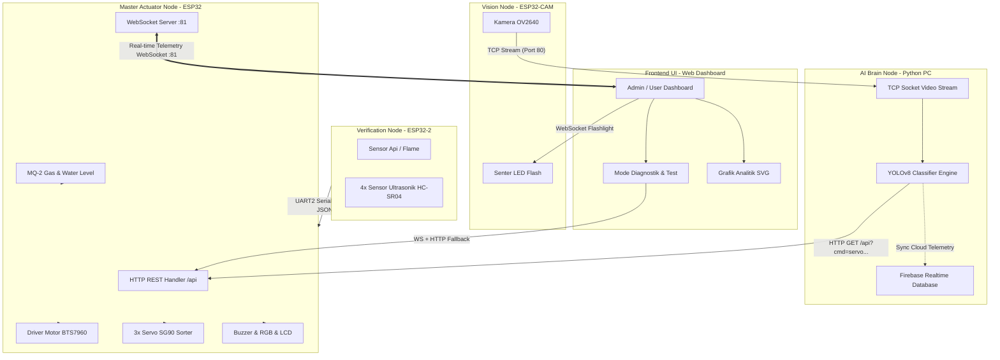

<div align="center">

# 🏥 AIoT Smart Medical Waste Sorting & Safety Monitoring System

**Sistem Deteksi, Pemilahan Limbah Medis Otomatis & Monitoring Keselamatan Berbasis AI Computer Vision, IoT Multi-Node ESP32, dan Cloud Realtime**

[](https://www.espressif.com/)
[](https://ultralytics.com/)
[](https://opencv.org/)
[](https://www.python.org/)
[](https://www.arduino.cc/)
[](https://firebase.google.com/)
[](https://developer.mozilla.org/en-US/docs/Web/API/WebSockets_API)

</div>

---

## 📖 Daftar Isi
- [📌 Deskripsi Proyek](#-deskripsi-proyek)
- [✨ Fitur Unggulan](#-fitur-unggulan)
- [🏗️ Arsitektur Multi-Node Sistem](#️-arsitektur-multi-node-sistem)
- [🗺️ Peta Pin & Wiring Hardware](#️-peta-pin--wiring-hardware)
- [💻 Struktur Direktori Proyek](#-struktur-direktori-proyek)
- [🧪 Mode Diagnostik & Pengujian Hardware Web](#-mode-diagnostik--pengujian-hardware-web)
- [⚙️ Instalasi & Persiapan](#️-instalasi--persiapan)
- [🚀 Panduan Menjalankan Sistem](#-panduan-menjalankan-sistem)
- [📊 Analitik Lokal & Integrasi Firebase Cloud](#-analitik-lokal--integrasi-firebase-cloud)
- [🎓 Pelatihan Model YOLOv8 Kustom](#-pelatihan-model-yolov8-kustom)
- [📡 Diagram Alur Data Sistem](#-diagram-alur-data-sistem)
- [👥 Kontributor](#-kontributor)

---

## 📌 Deskripsi Proyek

**AIoT Smart Medical Waste Sorting System** adalah solusi otomasi cerdas yang dirancang untuk mengatasi bahaya kontak langsung dan risiko penularan infeksi nosokomial pada pengelolaan limbah medis di rumah sakit dan fasilitas kesehatan.

Sistem memanfaatkan kamera nirkabel berlatensi rendah untuk mengidentifikasi limbah secara *real-time* menggunakan model **YOLOv8 Deep Learning**, kemudian secara mekanis menyortirnya ke tiga kompartemen terisolasi melalui pintu aktuator servo pada sabuk konveyor:

| Kategori Limbah Medis | Titik Pemilah | Indikator Visual | Contoh Objek |
|:---:|:---:|:---:|:---|
| 🟡 **Limbah Infeksius** | **Pintu 1 (Servo 1)** | Kantong Kuning | Suntikan bekas, jarum, plester darah, perban kotor |
| 🟣 **Limbah Non-Infeksius** | **Pintu 2 (Servo 2)** | Kantong Hitam / Ungu | Botol plastik infus/obat, kain kasa bersih, kemasan medis |
| 🔴 **Limbah B3 (Bahan Berbahaya)** | **Pintu 3 (Servo 3)** | Kantong Merah | Obat kedaluwarsa, baterai alat medis, sisa bahan kimia |

Selain pemilahan otomatis, sistem dilengkapi **jaringan sensor keselamatan lingkungan terpadu** (gas berbahaya/asap MQ-2 terkalibrasi otomatis, sensor luapan air, dan deteksi api) serta **verifikasi sensor ultrasonik 4-channel** yang memastikan limbah telah jatuh ke tempat yang tepat.

---

## ✨ Fitur Unggulan

### 🤖 1. AI Computer Vision & Deep Learning (YOLOv8)
- **High-Speed Inference**: Klasifikasi visual real-time hingga 60+ FPS dengan model kustom YOLOv8.
- **Asynchronous TCP Video Stream**: Penerimaan aliran frame video berlatensi sangat rendah dari ESP32-CAM tanpa membebani thread antarmuka.
- **Smart Operator Presence (Haarcascade Face Detection)**: Konveyor dapat menyala otomatis saat operator berada di dekat tempat sampah dan masuk ke mode standby saat operator pergi.
- **Anti-Flicker Decision Filter**: Mencegah kesalahan aktuasi akibat osilasi deteksi sementara.

### ⚙️ 2. Sistem Kontrol Aktuator Tangguh
- **High-Power Driver BTS7960 (43A H-Bridge)**: Kontrol kecepatan PWM 0–255, arah maju/mundur, dan efisiensi konsumsi daya.
- **3x Independent Sorter Servos (SG90/MG90S)**: Buka-tutup pintu otomatis berbasis timer presisi (*Hold-and-Release* 400ms).
- **Dual Conveyor Modes**:
  - `Keep Going (Mode 0)`: Konveyor berjalan kontinu untuk volume limbah padat.
  - `Less Energy (Mode 1)`: Konveyor hanya bergerak 5 detik saat limbah terdeteksi untuk efisiensi energi.

### 🚨 3. Sistem Keselamatan Multilapis & Fail-Safe Otonom
- **Dynamic MQ-2 Baseline Calibration**: Kalibrasi udara bersih otomatis saat startup tanpa perlu hardcode nilai ambang.
- **Dual-Threshold Flame & Water Sensor**: Deteksi instan titik api dan luapan cairan limbah.
- **Instant Safety Lockout**: Saat kondisi bahaya terjadi:
  1. Motor konveyor mati seketika.
  2. Semua pintu servo terkunci rapat.
  3. Passive Buzzer membunyikan alarm 2000 Hz.
  4. RGB LED berkedip sesuai kode warna bahaya (Merah=Api, Biru=Air, Ungu=Gas).
  5. Layar LCD 16x2 I2C menampilkan pesan darurat.
  6. Web Dashboard menampilkan banner peringatan merah menyala.

### 🌐 4. Web Monitoring & Control Panel Modern (Glassmorphism UI)
- **Zero-Dependency & 100% Offline Capable**: Berjalan langsung di browser PC, tablet, maupun smartphone tanpa perlu internet.
- **Dual Communication Protocol**: WebSockets (Port 81) untuk telemetri real-time sub-detik + fallback HTTP REST API (`/api`).
- **Role-Based Authentication**:
  - `Pengguna (Guest)`: Tampilan minimalis untuk memantau status limbah dan kondisi sensor.
  - `Admin (Admin / Admin123)`: Kontrol penuh motor, pengatur sudut servo, konfigurasi IP, dan mode diagnostik hardware.
- **Ultrasonic Live Radar Modal**: Visualisasi titik halangan pada 4 sensor ultrasonik secara interaktif.
- **Offline Analytics**: Diagram lingkaran proporsi limbah (SVG) & grafik riwayat bahaya sensor yang tersimpan aman di `localStorage`.

---

## 🏗️ Arsitektur Multi-Node Sistem

Sistem ini dirancang dengan pendekatan modular **Multi-Node Embedded IoT**:

```
┌─────────────────────────────────────────────────────────────────────────────┐
│                       MULTI-NODE HARDWARE TOPOLOGY                          │
├───────────────────┬───────────────────┬─────────────────────────────────────┤
│ Node              │ Komponen Utama    │ Peran & Tanggung Jawab              │
├───────────────────┼───────────────────┼─────────────────────────────────────┤
│ 1. Master Node    │ ESP32 DevKit C v4 │ Kontroler motor BTS7960, 3x servo,  │
│                   │                   │ sensor MQ-2, sensor air, buzzer,    │
│                   │                   │ LCD 16x2, WebSocket & Web Server.   │
├───────────────────┼───────────────────┼─────────────────────────────────────┤
│ 2. Sensor Node    │ ESP32 ke-2        │ Membaca Flame Sensor & 4x HC-SR04   │
│                   │                   │ (US1 Anomali + US2 Pintu A, B, C), │
│                   │                   │ kirim stream JSON UART2 @ 9600 baud.│
├───────────────────┼───────────────────┼─────────────────────────────────────┤
│ 3. Vision Node    │ AI-Thinker        │ Stream video TCP Port 80 (QVGA)     │
│                   │ ESP32-CAM         │ & listener senter LED via WS Port 81│
├───────────────────┼───────────────────┼─────────────────────────────────────┤
│ 4. Network Node   │ ESP32 Standalone  │ Dedicated SoftAP Router (Wi-Fi AP)  │
│                   │                   │ SSID: "Absolute Solver" (No Internet│
├───────────────────┼───────────────────┼─────────────────────────────────────┤
│ 5. AI Processing  │ PC / Laptop       │ Menjalankan Python YOLOv8 & OpenCV, │
│                   │                   │ sinkronisasi Firebase Cloud.        │
└───────────────────┴───────────────────┴─────────────────────────────────────┘
```

---

## 🗺️ Peta Pin & Wiring Hardware

### 1. ESP32 Utama (Master Actuator & Safety Node)
| Perangkat | Pin ESP32 | Mode / Keterangan |
|---|:---:|---|
| **LCD 16x2 SDA** | `GPIO 21` | I2C Data (Address `0x27` / `0x3F`) |
| **LCD 16x2 SCL** | `GPIO 22` | I2C Clock |
| **Buzzer Pasif** | `GPIO 32` | PWM Channel 9 (2000 Hz) |
| **Push Button Manual** | `GPIO 5` | `INPUT_PULLUP` (Start / Stop Darurat) |
| **Servo 1 (Infeksius)** | `GPIO 33` | 50Hz PWM Timer (Pintu Kuning) |
| **Servo 2 (Non-Infeksius)** | `GPIO 19` | 50Hz PWM Timer (Pintu Hitam/Ungu) |
| **Servo 3 (Limbah B3)** | `GPIO 18` | 50Hz PWM Timer (Pintu Merah) |
| **MQ-2 Gas (AOUT)** | `GPIO 35` | ADC1 Channel 7 (Aman saat WiFi aktif) |
| **MQ-2 Gas (DOUT)** | `GPIO 27` | Digital Input (Active LOW) |
| **Water Level (AOUT)** | `GPIO 36` | ADC1 Channel 0 (Pin VP) |
| **RGB LED - Merah** | `GPIO 15` | PWM Channel 6 |
| **RGB LED - Hijau** | `GPIO 2` | PWM Channel 7 |
| **RGB LED - Biru** | `GPIO 23` | PWM Channel 8 |
| **BTS7960 RPWM (Maju)** | `GPIO 4` | PWM Channel 4 (Kecepatan Maju) |
| **BTS7960 LPWM (Mundur)**| `GPIO 17` | PWM Channel 5 (Kecepatan Mundur) |
| **BTS7960 R_EN + L_EN** | `GPIO 16` | Digital Output (HIGH = Aktif) |
| **UART2 RX (← ESP32-2 TX)** | `GPIO 13` | Terima paket telemetri JSON sensor |
| **UART2 TX (Reserved)** | `GPIO 25` | Komunikasi 2-arah |

### 2. ESP32 ke-2 (Sensor Verification & Ultrasonic Node)
| Perangkat | Pin ESP32 | Keterangan |
|---|:---:|---|
| **Flame Sensor DOUT** | `GPIO 34` / `13` | Active LOW saat terdeteksi api |
| **US1 Anomali (Trig / Echo)** | `GPIO 12` / `GPIO 35` | Deteksi limbah abnormal di konveyor |
| **US2 Pintu A (Trig / Echo)** | `GPIO 27` / `GPIO 32` | Verifikasi limbah Pintu 1 (Infeksius) |
| **US2 Pintu B (Trig / Echo)** | `GPIO 26` / `GPIO 33` | Verifikasi limbah Pintu 2 (Non-Infeksius) |
| **US2 Pintu C (Trig / Echo)** | `GPIO 14` / `GPIO 35` | Verifikasi limbah Pintu 3 (B3) |
| **UART TX (→ ESP32-1 RX)** | `GPIO 17` (TX2) | Kirim string JSON 9600 Baud |

> ⚠️ **Catatan Penting Daya & Grounding:**
> - Pastikan semua **GND (Common Ground)** terhubung bersama antara kedua ESP32, ESP32-CAM, driver motor BTS7960, dan Power Supply eksternal.
> - Sensor Ultrasonik HC-SR04 **wajib mendapatkan supply 5V (VIN)** agar pembacaan akurat.

---

## 💻 Struktur Direktori Proyek

```text
📦 Code and all/
 ┣ 📂 Python/
 ┃ ┣ 📜 main_yolo.py            ← Script utama (TCP Video, YOLOv8 AI, Kontrol ESP32)
 ┃ ┣ 📜 firebase_service.py     ← Layanan Cloud Realtime Database Firebase
 ┃ ┣ 📜 train_yolo.py           ← Script training model klasifikasi kustom YOLOv8
 ┃ ┣ 📜 label_manual.py         ← Utility GUI labeling dataset
 ┃ ┣ 📜 test_firebase.py        ← Script verifikasi koneksi Firebase
 ┃ ┣ 📜 test_cam.py             ← Tester koneksi streaming kamera
 ┃ ┣ 📜 serviceAccountKey.json  ← Kredensial Firebase Admin SDK
 ┃ ┗ 📂 waste_model/
 ┃    ┗ 📂 weights/
 ┃       ┗ 📜 best.pt           ← Model bobot AI hasil training
 ┣ 📂 Esp32/
 ┃ ┗ 📜 Esp32.ino               ← Firmware ESP32 Utama (BTS7960 Driver & Master IoT)
 ┣ 📂 Esp32_2/
 ┃ ┗ 📜 Esp32_2.ino             ← Firmware ESP32 ke-2 (Sensor Flame & 4x Ultrasonik)
 ┣ 📂 Esp32_CAM/
 ┃ ┗ 📂 Esp32_CAM/
 ┃    ┗ 📜 Esp32_CAM.ino        ← Firmware ESP32-CAM (TCP Video Streamer & Flash WS)
 ┣ 📂 Esp32_Hotspot/
 ┃ ┗ 📜 Esp32_Hotspot.ino       ← Firmware ESP32 Access Point (Router Mandiri)
 ┣ 📂 Web/
 ┃ ┗ 📜 admin_dashboard.html    ← Antarmuka Web Dashboard (Standalone & Offline Ready)
 ┣ 📂 BTS7960 Version/          ← Versi driver motor BTS7960 43A High-Power
 ┣ 📂 DRV Version/              ← Versi driver motor DRV8833
 ┣ 📂 Gas Sensor Fixed Code/    ← Koleksi firmware kalibrasi gas & panduan troubleshooting
 ┣ 📜 Arsitektur.md             ← Dokumentasi mendalam arsitektur sistem
 ┗ 📜 README.md                 ← Dokumentasi utama repositori
```

---

## 🧪 Mode Diagnostik & Pengujian Hardware Web

Di bagian bawah Web Dashboard terdapat panel **🧪 Mode Diagnostik & Uji Coba Hardware** yang memungkinkan penguji/evaluator menguji setiap komponen secara mandiri tanpa harus memicu bahaya fisik:

```
┌───────────────────────────────────────────────────────────────────────────┐
│              🧪 FITUR DIAGNOSTIK & SELF-TEST (WEB DASHBOARD)              │
├────────────────────┬──────────┬───────────────────────────────────────────┤
│ Tombol Pengujian   │ Durasi   │ Efek & Respon Sistem                      │
├────────────────────┼──────────┼───────────────────────────────────────────┤
│ 🔊 Test Buzzer     │ 1 Detik  │ Membunyikan buzzer fisik & audio synth web│
│                    │          │ frekuensi 2000 Hz, flash badge alarm.     │
├────────────────────┼──────────┼───────────────────────────────────────────┤
│ 🔥 Test Sensor Api │ 3 Detik  │ Memicu simulasi bahaya api di dashboard,  │
│                    │          │ banner merah darurat, lalu pulih otomatis.│
├────────────────────┼──────────┼───────────────────────────────────────────┤
│ 💨 Test Sensor Gas │ 4 Detik  │ Simulasi lonjakan ADC gas ke 3800 tanpa   │
│                    │          │ mengunci sistem, bar berubah kuning/oranye│
├────────────────────┼──────────┼───────────────────────────────────────────┤
│ 💧 Test Sensor Air │ 4 Detik  │ Simulasi kenaikan air ADC ke 3500,        │
│                    │          │ bar progress cyan naik 85% lalu normal.   │
├────────────────────┼──────────┼───────────────────────────────────────────┤
│ ⚙️ Test Motor DC   │ 5 Detik  │ Sequence otomatis: Maju 2s ➔ Jeda 1s ➔    │
│                    │          │ Mundur 2s ➔ Stop, animasi tombol sinkron. │
├────────────────────┼──────────┼───────────────────────────────────────────┤
│ 🎯 Test YOLO AI    │ 2.5 Detik│ Membuka dialog pilihan kategori limbah    │
│    (Sortir Servo)  │          │ (Infeksius/Non-Inf/B3), memutar servo 90°,│
│                    │          │ simulasikan sensor US2 & catat statistik. │
└────────────────────┴──────────┴───────────────────────────────────────────┘
```

> 💡 **Dual-Transport Reliability:** Semua tombol pengujian mengirimkan perintah melalui **WebSocket (Port 81)** dan secara otomatis menyediakan **HTTP REST API (`/api?cmd=test&target=...`) fallback**, sehingga pengujian tetap bekerja mulus di segala kondisi jaringan browser.

---

## ⚙️ Instalasi & Persiapan

### 1. Persiapan Firmware ESP32 (Arduino IDE)
1. Buka **Arduino IDE** dan install board package **ESP32 by Espressif Systems** (v2.0.x atau v3.x).
2. Install library yang dibutuhkan melalui **Library Manager**:
   - `ESP32Servo` (oleh Kevin Harrington)
   - `WebSockets` (oleh Markus Sattler)
   - `ArduinoJson` (oleh Benoit Blanchon)
   - `LiquidCrystal_I2C` (oleh Frank de Brabander)
3. Buka `Esp32/Esp32.ino`, sesuaikan nama SSID & Password jika tidak menggunakan hotspot default:
   ```cpp
   #define WIFI_SSID "Absolute Solver"
   #define WIFI_PASS "12345678"
   ```
4. Upload sketch ke masing-masing modul:
   - `Esp32/Esp32.ino` ➔ ESP32 Utama (Master)
   - `Esp32_2/Esp32_2.ino` ➔ ESP32 ke-2 (Sensor Ultrasonik & Flame)
   - `Esp32_CAM/Esp32_CAM/Esp32_CAM.ino` ➔ Modul ESP32-CAM
   - `Esp32_Hotspot/Esp32_Hotspot.ino` ➔ ESP32 Hotspot Router (jika digunakan)

### 2. Persiapan Environment Python
Install seluruh dependensi Python yang diperlukan:
```bash
pip install ultralytics opencv-python websocket-client numpy firebase-admin
```

---

## 🚀 Panduan Menjalankan Sistem

### Langkah 1: Hubungkan ke Jaringan Wi-Fi
Sambungkan PC/Laptop Anda ke Wi-Fi **`Absolute Solver`** (atau hotspot yang digunakan).

### Langkah 2: Jalankan Script AI YOLO & Computer Vision
```bash
cd "Python"
python main_yolo.py
```
*Script akan secara otomatis menghubungkan stream video TCP ESP32-CAM, mengaktifkan model klasifikasi YOLOv8, dan siap mengirim komando pemilahan ke ESP32.*

**Kontrol Tombol Keyboard pada Jendela Kamera:**
- `S` : Simpan screenshot manual.
- `A` : Toggle mode Auto-Capture (panen dataset).
- `F` : Toggle lampu senter Flash ESP32-CAM.
- `Q` : Keluar dari program secara aman.

### Langkah 3: Buka Web Dashboard Monitoring
Buka file `Web/admin_dashboard.html` langsung di browser, atau akses melalui URL IP ESP32:
```
http://192.168.4.2/
```
- **Login Guest**: Klik "Masuk sebagai Pengguna".
- **Login Admin**: Username `Admin`, Password `Admin123`.
- Tekan **▶ START SISTEM** pada dashboard untuk mulai menjalankan pemilahan.

---

## 📊 Analitik Lokal & Integrasi Firebase Cloud

### 📈 1. Offline Dashboard Analytics
Klik ikon menu **☰** di pojok kanan atas Web Dashboard untuk membuka bilah analitik:
- **Pie Chart SVG Murni**: Menampilkan distribusi volume tiap jenis limbah medis secara real-time.
- **Sensor Incident History**: Grafik garis tren frekuensi bahaya gas/asap, air berlebih, dan api.
- **Persistent LocalStorage**: Data tetap tersimpan aman di browser dan tidak terhapus saat refresh.

### ☁️ 2. Cloud Realtime Database (Firebase)
Sistem dilengkapi modul `firebase_service.py` untuk sinkronisasi otomatis ke cloud:
- **`smart_bin/live_status`**: Telemetri status deteksi terkini, suhu, gas ADC, status motor, dan servo.
- **`smart_bin/waste_history`**: Log riwayat setiap objek limbah yang berhasil terverifikasi masuk ke kantong sampah beserta timestamp dan akurasi confidence AI.
- **`smart_bin/safety_alerts`**: Pencatatan riwayat insiden bahaya untuk audit keselamatan rumah sakit.

---

## 🎓 Pelatihan Model YOLOv8 Kustom

Untuk melatih model AI dengan objek limbah medis baru:
1. Jalankan `main_yolo.py` dan tekan `A` untuk mengaktifkan **Auto-Capture** dataset di depan kamera.
2. Beri label gambar menggunakan `label_manual.py` atau tool anotasi seperti [Roboflow](https://roboflow.com/).
3. Jalankan script pelatihan:
   ```bash
   python train_yolo.py
   ```
4. Bobot terbaik otomatis tersimpan di `Python/waste_model/weights/best.pt`.

---

## 📡 Diagram Alur Data Sistem


```mermaid
graph TD
    subgraph VISION_LAYER [Vision Node - ESP32-CAM]
        CAM[Kamera OV2640]
        FLASH[Senter LED Flash]
    end

    subgraph AI_BRAIN [AI Brain Node - Python PC]
        TCP_RECV[TCP Socket Video Stream]
        YOLO[YOLOv8 Classifier Engine]
        FIREBASE[Firebase Realtime Database]
    end

    subgraph CONTROLLER_LAYER [Master Actuator Node - ESP32]
        HTTP_API[HTTP REST Handler /api]
        WS_SRV[WebSocket Server :81]
        BTS[Driver Motor BTS7960]
        SERVOS[3x Servo SG90 Sorter]
        SENSORS[MQ-2 Gas & Water Level]
        ALARM[Buzzer & RGB & LCD]
    end

    subgraph SENSOR_NODE [Verification Node - ESP32-2]
        FLAME[Sensor Api / Flame]
        US_RADAR[4x Sensor Ultrasonik HC-SR04]
    end

    subgraph UI_LAYER [Frontend UI - Web Dashboard]
        DASH[Admin / User Dashboard]
        TEST_PANEL[Mode Diagnostik & Test]
        ANALYTICS[Grafik Analitik SVG]
    end

    CAM -- "TCP Stream (Port 80)" --> TCP_RECV
    TCP_RECV --> YOLO
    YOLO -- "HTTP GET /api?cmd=servo..." --> HTTP_API
    YOLO -. "Sync Cloud Telemetry" .-> FIREBASE
    
    SENSOR_NODE -- "UART2 Serial Stream JSON" --> CONTROLLER_LAYER
    CONTROLLER_LAYER --> BTS
    CONTROLLER_LAYER --> SERVOS
    CONTROLLER_LAYER --> ALARM
    SENSORS --> CONTROLLER_LAYER

    WS_SRV <== "Real-time Telemetry WebSocket :81" ==> DASH
    DASH --> TEST_PANEL
    DASH --> ANALYTICS
    TEST_PANEL -- "WS + HTTP Fallback" --> HTTP_API
    DASH -- "WebSocket Flashlight" --> FLASH
```

---

## 👥 Kontributor

Proyek ini dikembangkan dan didedikasikan untuk inovasi kompetisi **CNC HIMTIKA**.

> 💡 *"Melindungi tenaga medis dan petugas kebersihan dari ancaman bahaya limbah medis melalui otomatisasi cerdas, nirsentuh, dan andal berbasis Artificial Intelligence of Things (AIoT)."*

---
<div align="center">
  <sub>Built with passion for Medical Innovation &amp; IoT Excellence.</sub>
</div>
